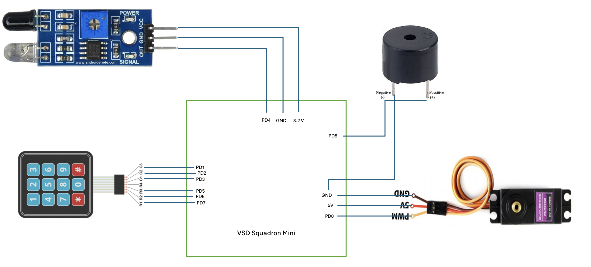

# Home safety system
## Introduction
Our home safety system integrates a smart lock and a burglar detection mechanism to enhance your home's security. The smart lock operates with a password entry system, allowing only authorized individuals to unlock the door. In addition, the burglar detector monitors the premises when the house is locked. If an intruder is detected, the system triggers an alarm to alert you immediately. This dual-layered approach ensures robust protection against unauthorized access and potential break-ins.

## Overview
The home safety system showcased here introduces an innovative solution utilizing a VSD Squadron Mini Developement Board, an IR sensor, a piezo buzzer and a Servo Motor. It essentially comprises of a smart door lock using a keypad and a servo motor, and a burglar detection system using an IR sensor and piezo buzzer.
- If the password entered by the user on the keypad is correct, the servo motor opens the door to allow entry into the house. 
- If the password entered is incorrect, the user is denied entry into the house and the door remains closed.
- If the door is closed and movement is detected in the house using the IR sensor, the piezo buzzer alarms the home owner that there is a potential burglar who has brached into the house.
- If the password is entered correctly and the door is open, the IR sensor is switched off to avoid wrong detection.

## Components Required: 
- VSD Squadron Mini developement board with CH32V003F4U6 chip with 32-bit RISC-V core based on RV32EC instruction set
- IR sensor
- Keypad
- Servo motor
- Piezo buzzer
- Breadboard
- Jumper Wires

## Circuit connection diagram


## Table for pin connection
|IR sensor | VSD Squadron Mini|
|----------|------------------|
| VCC | 5V|
| GND | GND |
| OUT | PD4 |

| Servo motor | VSD Squadron Mini|
|-------|-----|
| PWM | PD0 |
| 5V | 5V |
|GND | GND|

| Piezo buzzer | VSD Squadron Mini|
|---|---|
|Positive | PD5|
|GND| GND|

| Keypad           | VSD Squadron Mini|
|------------------|------------------|
| R1               | PD7              |
| R2               | PD6|
| R3 | PD5 |
| R4 | None |
| C1 | PD3 |
| C2 | PD2 |
| C3 | PD1 |

## Code 
```
#include <ch32v00x.h>
#include <debug.h>

#define BUZZ_GPIO_PORT GPIOD
#define BUZZ_GPIO_PIN GPIO_Pin_5
#define BUZZ_CLOCK_ENABLE RCC_APB2PeriphClockCmd(RCC_APB2Periph_GPIOD, ENABLE)

#define IR_GPIO_PORT GPIOD
#define IR_GPIO_PIN GPIO_Pin_4
#define IR_CLOCK_ENABLE RCC_APB2PeriphClockCmd(RCC_APB2Periph_GPIOD, ENABLE)

#define B1_GPIO_PORT GPIOD
#define B1_GPIO_PIN GPIO_Pin_1
#define B1_CLOCK_ENABLE RCC_APB2PeriphClockCmd(RCC_APB2Periph_GPIOD, ENABLE)

#define B2_GPIO_PORT GPIOD
#define B2_GPIO_PIN GPIO_Pin_6
#define B2_CLOCK_ENABLE RCC_APB2PeriphClockCmd(RCC_APB2Periph_GPIOD, ENABLE)

#define B3_GPIO_PORT GPIOD
#define B3_GPIO_PIN GPIO_Pin_3
#define B3_CLOCK_ENABLE RCC_APB2PeriphClockCmd(RCC_APB2Periph_GPIOD, ENABLE)


void NMI_Handler(void) __attribute__((interrupt("WCH-Interrupt-fast")));
void HardFault_Handler(void) __attribute__((interrupt("WCH-Interrupt-fast")));
void Delay_Init(void);
void Delay_Ms(uint32_t n);

#define PWM_MODE1   0
#define PWM_MODE2   1

/* PWM Output Mode Selection */
//#define PWM_MODE PWM_MODE1
#define PWM_MODE PWM_MODE2

void TIM1_PWMOut_Init(u16 arr, u16 psc, u16 ccp)
{
    GPIO_InitTypeDef GPIO_InitStructure={0};
    TIM_OCInitTypeDef TIM_OCInitStructure={0};
    TIM_TimeBaseInitTypeDef TIM_TimeBaseInitStructure={0};

    RCC_APB2PeriphClockCmd( RCC_APB2Periph_GPIOD | RCC_APB2Periph_TIM1, ENABLE );

    GPIO_InitStructure.GPIO_Pin = GPIO_Pin_2;
    GPIO_InitStructure.GPIO_Mode = GPIO_Mode_AF_PP;
    GPIO_InitStructure.GPIO_Speed = GPIO_Speed_10MHz;
    GPIO_Init( GPIOD, &GPIO_InitStructure );

    TIM_TimeBaseInitStructure.TIM_Period = arr;
    TIM_TimeBaseInitStructure.TIM_Prescaler = psc;
    TIM_TimeBaseInitStructure.TIM_ClockDivision = TIM_CKD_DIV1;
    TIM_TimeBaseInitStructure.TIM_CounterMode = TIM_CounterMode_Up;
    TIM_TimeBaseInit( TIM1, &TIM_TimeBaseInitStructure);

#if (PWM_MODE == PWM_MODE1)
	TIM_OCInitStructure.TIM_OCMode = TIM_OCMode_PWM1;

#elif (PWM_MODE == PWM_MODE2)
    TIM_OCInitStructure.TIM_OCMode = TIM_OCMode_PWM2;

#endif

    TIM_OCInitStructure.TIM_OutputState = TIM_OutputState_Enable;
    TIM_OCInitStructure.TIM_Pulse = ccp;
    TIM_OCInitStructure.TIM_OCPolarity = TIM_OCPolarity_High;
    TIM_OC1Init( TIM1, &TIM_OCInitStructure );

    TIM_CtrlPWMOutputs(TIM1, ENABLE );
    TIM_OC1PreloadConfig( TIM1, TIM_OCPreload_Disable );
    TIM_ARRPreloadConfig( TIM1, ENABLE );
    TIM_Cmd( TIM1, ENABLE );
}

int main(void)
{
	NVIC_PriorityGroupConfig(NVIC_PriorityGroup_2);
	SystemCoreClockUpdate();
	Delay_Init();

	GPIO_InitTypeDef GPIO_InitStructure = {0};

	BUZZ_CLOCK_ENABLE;
	GPIO_InitStructure.GPIO_Pin = BUZZ_GPIO_PIN;
	GPIO_InitStructure.GPIO_Mode = GPIO_Mode_Out_PP;
	GPIO_InitStructure.GPIO_Speed = GPIO_Speed_50MHz;
	GPIO_Init(BUZZ_GPIO_PORT, &GPIO_InitStructure);

	IR_CLOCK_ENABLE;
	GPIO_InitStructure.GPIO_Pin = IR_GPIO_PIN;
	GPIO_InitStructure.GPIO_Mode = GPIO_Mode_IPU;
	GPIO_InitStructure.GPIO_Speed = GPIO_Speed_50MHz;
	GPIO_Init(IR_GPIO_PORT, &GPIO_InitStructure);

	B1_CLOCK_ENABLE;
	GPIO_InitStructure.GPIO_Pin = B1_GPIO_PIN;
	GPIO_InitStructure.GPIO_Mode = GPIO_Mode_IPU;
	GPIO_InitStructure.GPIO_Speed = GPIO_Speed_50MHz;
	GPIO_Init(B1_GPIO_PORT, &GPIO_InitStructure);

	B2_CLOCK_ENABLE;
	GPIO_InitStructure.GPIO_Pin = B2_GPIO_PIN;
	GPIO_InitStructure.GPIO_Mode = GPIO_Mode_IPU;
	GPIO_InitStructure.GPIO_Speed = GPIO_Speed_50MHz;
	GPIO_Init(B2_GPIO_PORT, &GPIO_InitStructure);

	B3_CLOCK_ENABLE;
	GPIO_InitStructure.GPIO_Pin = B3_GPIO_PIN;
	GPIO_InitStructure.GPIO_Mode = GPIO_Mode_IPU;
	GPIO_InitStructure.GPIO_Speed = GPIO_Speed_50MHz;
	GPIO_Init(B3_GPIO_PORT, &GPIO_InitStructure);

	uint8_t b1=0, b2=0, b3=0,state=0;
	uint8_t var;
	while (1)
	{	
		b1 = GPIO_ReadInputDataBit(B1_GPIO_PORT, B1_GPIO_PIN);
		if(state!=0){
			b2 = GPIO_ReadInputDataBit(B2_GPIO_PORT, B2_GPIO_PIN);
			b3 = GPIO_ReadInputDataBit(B3_GPIO_PORT, B3_GPIO_PIN);
		}
		
		if(state==0) 
		{
			if(b1==0)state=1;
		}
		else if(state==1){
			if(b1==0) continue;
			if(b1==1 && b2==1 && b3==0) state=2;
			else if(b1==0||b2==0) state=0;
		}
		else if(state==2){
			if(b3==0) continue;
			if(b1==1 && b2==0 && b3==1) state=3;
			else if(b1==0 || b3==0) state=0;
		}

		if(state==3){
			state=0;
			GPIO_WriteBit(BUZZ_GPIO_PORT, BUZZ_GPIO_PIN, 1u);
			Delay_Ms(2000);
			GPIO_WriteBit(BUZZ_GPIO_PORT, BUZZ_GPIO_PIN,0u);
			TIM1_PWMOut_Init( 100, 480-1, 10 );	
			
		}

		if(state!=3){
			var = GPIO_ReadInputDataBit(IR_GPIO_PORT, IR_GPIO_PIN);
			if(var == 0){
				GPIO_WriteBit(BUZZ_GPIO_PORT, BUZZ_GPIO_PIN, 1u);
			}
			else{
				GPIO_WriteBit(BUZZ_GPIO_PORT, BUZZ_GPIO_PIN, 0u);
			}
		}

	}
}

void NMI_Handler(void) {}
void HardFault_Handler(void)
{
	while (1)
	{
	}
}
```


## Video Demonstration
https://github.com/CKgoesBallistic/takeRISC/assets/122223691/cb39fe41-479c-4d59-b0a2-bb2cc0dc70e3

## FAULT INJECTION
This part of the project demonstrates how to use an Arduino to perform a brute force attack on a digital lock by trying all possible password combinations.
COMPONENTS
- Arduino Uno board
- Connecting wires


## SECURING THE FAULT

The security mechanism implemented in this project was inspired by CAPTCHA technology. CAPTCHAs differentiate between humans and bots by analyzing cursor movements. A human typically moves the cursor in a haphazard manner, whereas a bot makes sharp, linear movements.


Similarly, to detect brute force attempts on the digital lock, we analyze the time elapsed between consecutive button presses using a timer. If the time intervals are almost equal, it is likely that the attempts are being made by a bot, and the lock remains closed even if the correct password is entered.
